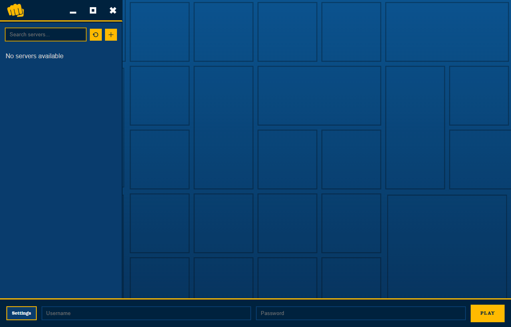

# DSS Browser

This is a browser for Derpy Script Servers, for players who run Derpy Script Loader.  
Derpy Script Loader/Server Download Links: [nexus](https://www.nexusmods.com/bullyscholarshipedition/mods/43) · [mediafire](https://www.mediafire.com/folder/clgtvlrnat179/derpy's_script_loader)

  
  

DSS Browser supports both Steam and Rockstar Games Launcher versions of Bully.

## Tutorial

1. Install Bully on Steam or Rockstar Launcher (Linux only supports Steam for now).
2. Install Derpy Script Loader on your client by following the tutorial on nexus. Download links above.
3. Install DSS Browser from [Releases](https://github.com/Vooogle/dss_browser/releases).
4. Go to Options.  
   - Rockstar Launcher: point it to `Launcher.exe`, and select the Bully: Scholarship Edition folder.  
   - Steam: point it to `Steam.exe` (or the Steam file on Linux).
5. Add a server or select one from the list, add your credentials and play.  
   AppImage recommended for Steam Deck.

## Server List

1. From [github.com/Vooogle/dss_worker_list](https://github.com/Vooogle/dss_worker_list) download the heartbeat scripts.
2. Turn on full system access on your dslconfig.ini
3. Add the heartbeat script into the scripts, and modify it to be correct for your server.

## Tutorial: Server Website Theme Colors

1. Host a simple webpage for your server (HTTPS recommended).
2. Add CSS variables with the `--bsb-` prefix to your page, for example:
   - `--bsb-primary`, `--bsb-primary-dark`, `--bsb-highlight`, `--bsb-text`
3. Set your server website URL in DSS Browser.  
   The app will pull the `--bsb-` variables from your site and theme the UI.

## Credits

- Input buttons: [https://kenney.nl/assets/input-prompts](https://kenney.nl/assets/input-prompts)
- Logo: [https://commons.wikimedia.org/wiki/File:SPB_fist.svg](https://commons.wikimedia.org/wiki/File:SPB_fist.svg)

## AI Disclosure

AI assistance was used in coding of this project.

## Legal Disclosure

This project is not associated with Derpy Script Server, Derpy Script Loader, Bully, Bully Anniversary Edition, Bully Scholarship Edition, Rockstar Games, or Take-Two Interactive.

## License

MIT

MIT allows you to use, modify, and distribute this software with attribution.  
This project is provided “as is” without warranty.
