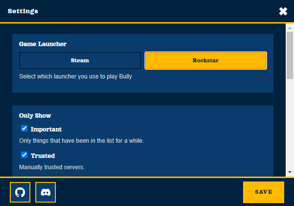
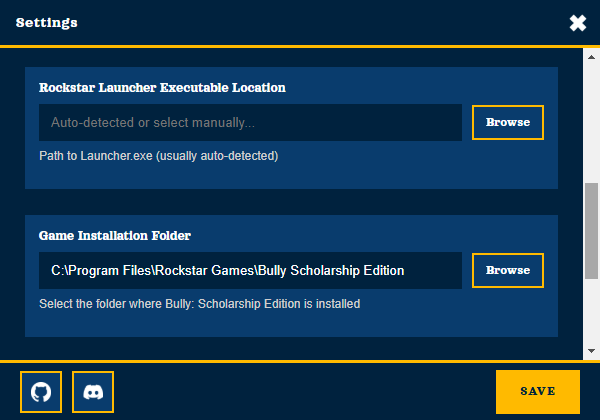
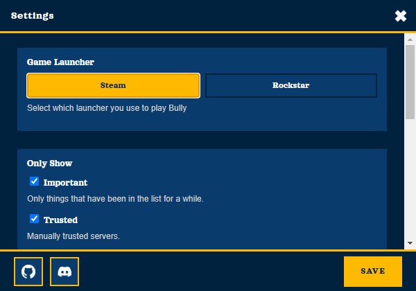
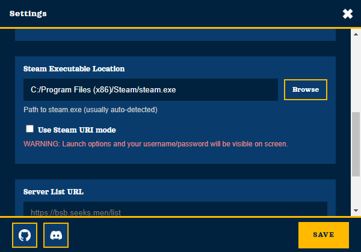
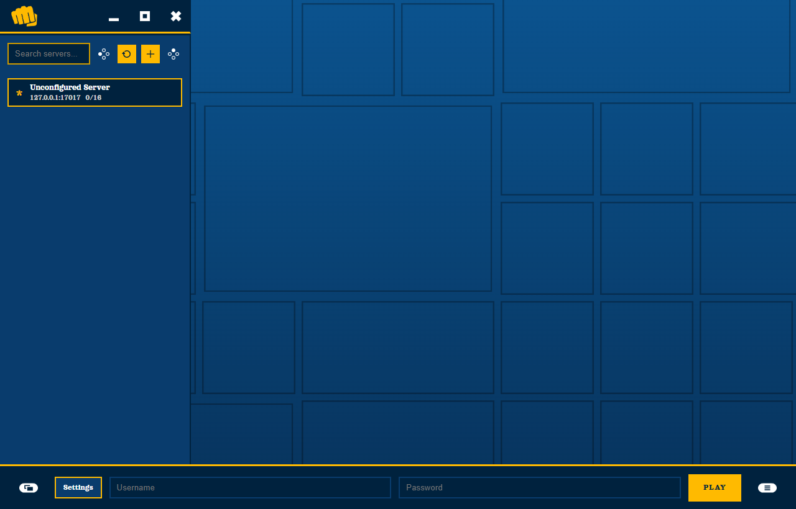

# DSS Browser

This is a browser for Derpy Script Servers, for players who run Derpy Script Loader.  
Derpy Script Loader/Server Download Links: [nexus](https://www.nexusmods.com/bullyscholarshipedition/mods/43) - [mediafire](https://www.mediafire.com/folder/clgtvlrnat179/derpy's_script_loader)

Bully Server Community Discord: [https://discord.gg/RHrsCx2acS](https://discord.gg/RHrsCx2acS)

<div>
  
  
</div>

DSS Browser supports both Steam and Rockstar Games Launcher versions of Bully.

## Tutorial

1. Install Bully on [Steam](https://store.steampowered.com/app/12200/Bully_Scholarship_Edition/) or [Rockstar Launcher](https://www.rockstargames.com/bully/) (Linux only supports Steam for now).
2. Install Derpy Script Loader on your client by following the tutorial on nexus.  
   Download links: [nexus](https://www.nexusmods.com/bullyscholarshipedition/mods/43) - [mediafire](https://www.mediafire.com/folder/clgtvlrnat179/derpy's_script_loader)
3. Install DSS Browser from [Releases](https://github.com/Vooogle/dss_browser/releases). AppImage recommended for Steam Deck.
4. Go to Options.

   **Rockstar Launcher**
   - Select Rockstar.  
     <br>
   - Open `Launcher.exe` and select the Bully: Scholarship Edition folder.  
     <br>
   **Steam**
   - Select Steam.  
     <br>
   - Open `Steam.exe` (or the Steam file on Linux).  
     <br>
5. Add a server or select one from the list, add your credentials and play.

## Controller Support

Controllers are supported for selecting a server, but no typing ability or closing the window.



## Server List

1. From [github.com/Vooogle/dss_worker_list](https://github.com/Vooogle/dss_worker_list) download the heartbeat script.
2. Turn on full system access on your dslconfig.ini
3. Add the heartbeat script into the scripts, and modify it to be correct for your server.

## Tutorial: Server Website Theme Colors

1. Add CSS variables with the `--bsb-` prefix to your page. Supported variables:
   - `--bsb-primary-light`
   - `--bsb-primary`
   - `--bsb-primary-dark`
   - `--bsb-primary-darker`
   - `--bsb-highlight-light`
   - `--bsb-highlight`
   - `--bsb-highlight-dark`
   - `--bsb-text`
   - `--bsb-text-muted`
2. Set your server website URL in DSS Browser. (defaults to https://IP or http://IP
   The app will pull the `--bsb-` variables from your site and theme the UI.

   Example:
   ```css
   :root {
     --bsb-primary-light: #7bd69a;
     --bsb-primary: #2f9f5f;
     --bsb-primary-dark: #1f6f45;
     --bsb-primary-darker: #0f3a24;
     --bsb-highlight-light: #d6f2c6;
     --bsb-highlight: #7fd36b;
     --bsb-highlight-dark: #4fa04a;
     --bsb-text: #f6fff8;
     --bsb-text-muted: #cfe6d6;
   }
   ```

## Credits

- Input buttons: [https://kenney.nl/assets/input-prompts](https://kenney.nl/assets/input-prompts)
- Logo: [https://commons.wikimedia.org/wiki/File:SPB_fist.svg](https://commons.wikimedia.org/wiki/File:SPB_fist.svg)
- Style inspiration: [https://github.com/heysnippy](https://github.com/heysnippy)
## AI Disclosure

AI assistance was used in coding of this project. All the assets and images were created by me or sourced online, visible from credits.

## Legal Disclosure

This project is not associated with Derpy Script Server, Derpy Script Loader, Bully, Bully Anniversary Edition, Bully Scholarship Edition, Rockstar Games, or Take-Two Interactive.

## License

MIT

MIT allows you to use, modify, and distribute this software with attribution.  
This project is provided "as is" without warranty.
